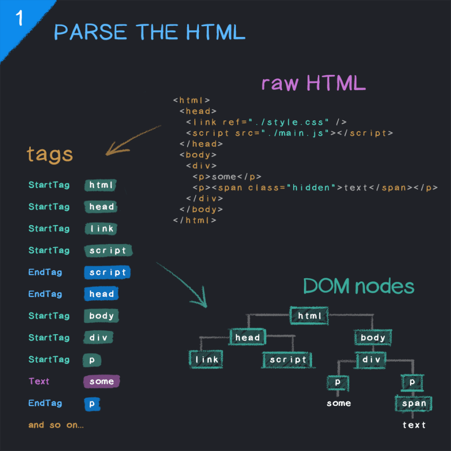
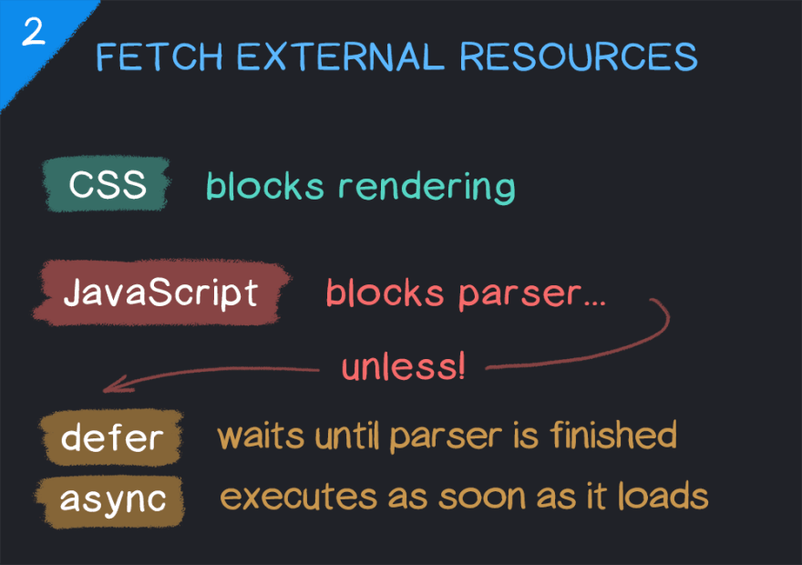
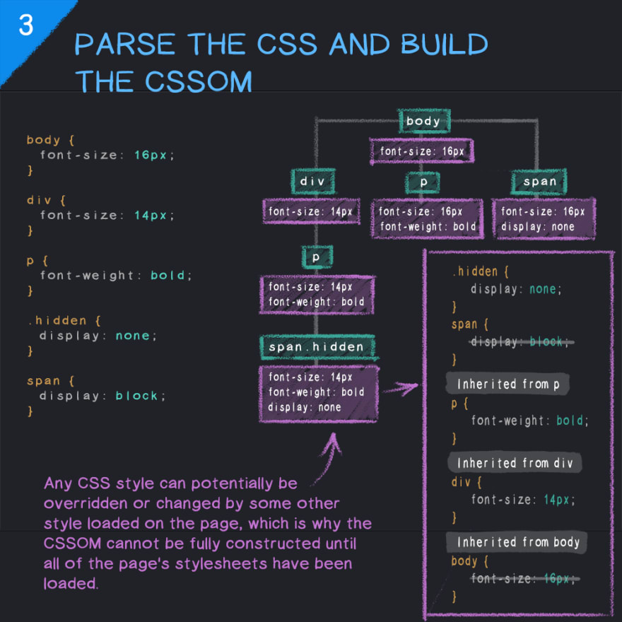
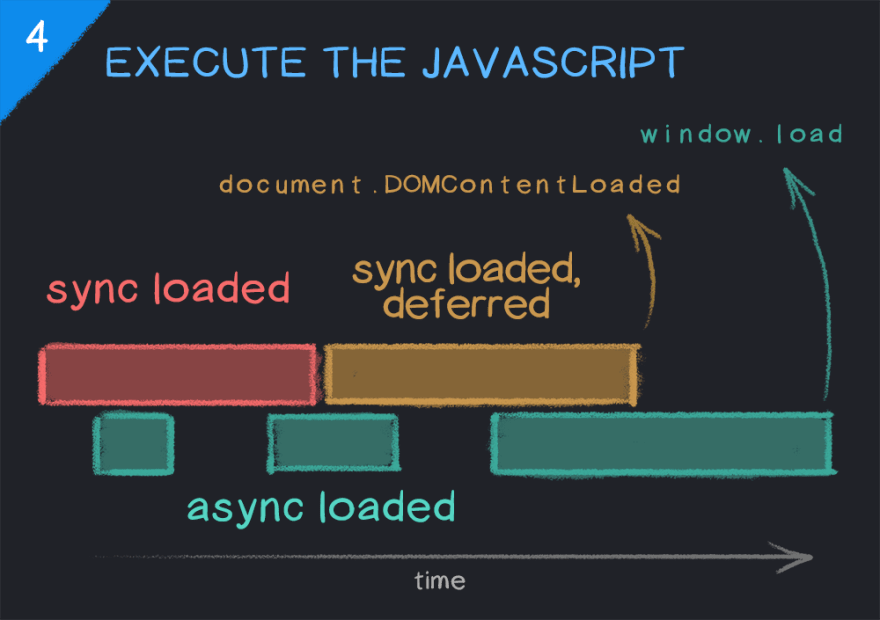
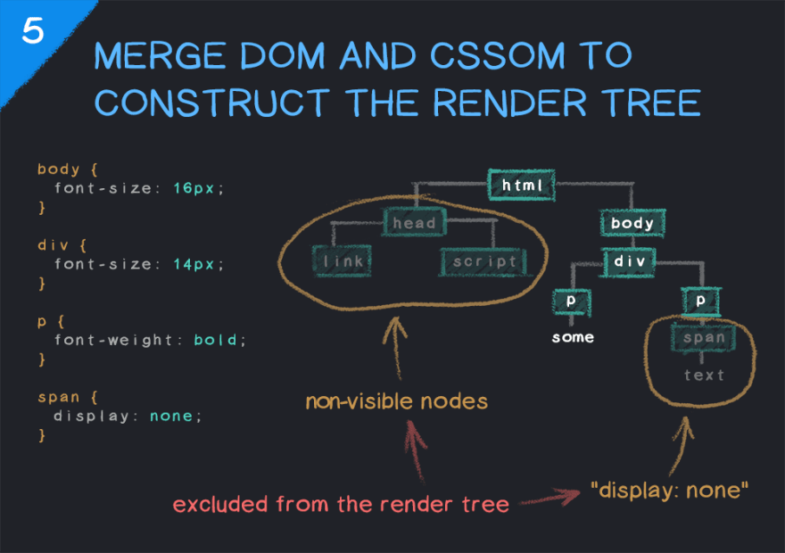
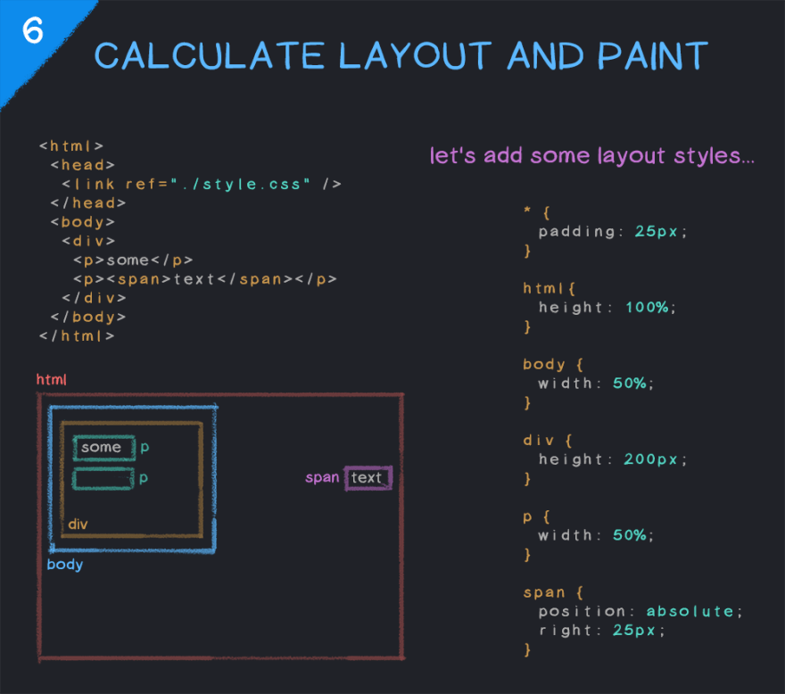

# Render

1. Parse the HTML into DOM(Document Object Model)
    
    > DOM is the data representation of the objects that comprise the structure and content of a document on the web.
    > 
    
    Break down the HTML into ************tokens************ that represent ******************************************start tags, end tags****************************************** and their ****************contents****************. From that it can construct the DOM.
    
    
    
2. Fetch external resources
    - CSS file: The parser will continue although it will **block rendering** until it has been loaded and parsed.
    - JS file: By default **block parsing** of the HTML while the JS file is loaded and parsed. `defer` and `async` allow the parser to continue while the JS file is loaded in the background.
        - `defer` means the execution of the file will be delayed until the parsing of the document is complete in the order they were discovered in the HTML.
        - `async` means the file will be executed as soon as it loads. The order cannot be guaranteed.
    
    
    
3. Parse the CSS and build the CSSOM(CSS Object Model)
    
    > CSSOM: a map of all CSS selectors and relevant properties for each selector in the form of a tree.
    > 
    
    
    
4. Execute the JavaScript
    
    
    
5. Merge DOM and CSSOM to construct the render tree
    
    
    
6. Calculate layout and paint
    
    Have a complete render tree the browser knows what to render, but not where to render it.  The rendering engine traverses the render tree, calculating the coordinates at which each node should be displayed.
    
    