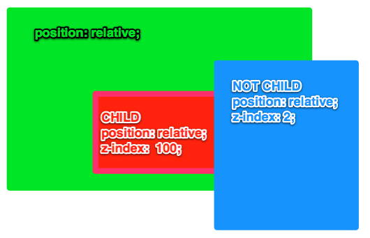

# Style

# z-index

Controls the vertical stacking order of elements that overlap. Without any z-index value, elements stack in the order that they appear in the DOM. If an element B sits on top of element A, a **child** element of element A can **never be higher** than element B.



# Visually hide content

- `width: 0; height: 0`
- `position: absolute; left: -99999px`

# @media

- `all` - for all media type devices
- `print` - for printers
- `speech` - for **screenreaders** that "reads" the page out loud
- `screen` - for computer screens, tablets, smart-phones etc.

```css
@media print {
  body {
    color: black;
  }
}
```

# display

| display | Description |
| --- | --- |
| none | Does not display an element. The document is rendered as if the element did not exist in the document tree. |
| block | The element consumes the whole line in the block direction. |
| inline | Elements can be laid out beside each other. |
| inline-block | Similar to inline, but allows some block properties like setting width and height. |
| table | Behaves like the table element. |
| table-row | Behaves like the tr element. |
| table-cell | Behaves like the td element. |
| list-item | Behaves like a li element which allows it to define list-style-type and list-type-position. |

## inline Vs inline-block

|  | block | inline-block | inline |
| --- | --- | --- | --- |
| Size | Fills up the width of its parent container | Depends on content | Depends on content |
| Positioning | Start on a new line and tolerates no HTML elements next to it | Flows along with other content and allows other elements beside it | Flows along with other content and allows other elements beside it |
| Can specify width and height | Yes | Yes | No. Will ignore if being set |
| Can be alighed with vertical-align | No | Yes | Yes |
| Margins and paddings | All sides respected | All sides respected | Only horizontal sides respected. Vertical space it takes up depends o line-height |
| Float | - | - | Becomes like a block element where you can set vertical margins and paddings |

# Position

## static

The element is **not affected** by the top, bottom, left and right properties.

## relative

Offset **relative to itself** based on the values of top, right, bottom and left. The offset does not affect the position of any other elements.

## absolute

Positioned relative to the **nearest positioned ancestor**.

## fixed

Positioned **relative to the viewport**, which means it always stays in the same place even if the page is scrolled. The top, right, bottom and left properties are used to position the element.

## sticky

Toggles **between relative and fixed**, depending on the scroll position. It is positioned **relative until a given offset** position is met in the viewport - then it sticks in place(like fixed).