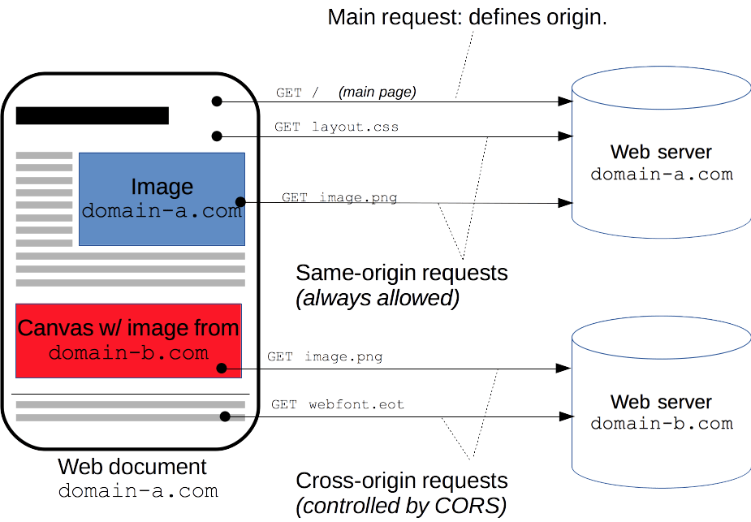

# Ajax

With Ajax(asynchronous JavaScript and XML), web applications can **send data to and retrieve** from a server asychronously(in the **background**) without interfering with the display and behavior of the existing page.

## Advantages

- Better interactivity. New content from the server can be **changed dynamically** without the need to reload the entire page.
- **State can be maintained** on a page. JavaScript variables and DOM state will persist because the main container page was not reloaded.

## Disadvantages

- Does **not work** if **JavaScript** has been **disabled** in the browser.
- Some webcrawlers do **not execute** JavaScript and would not see content that has been loaded by JavaScript.

# same-origin policy

**Prevents** JS from making requests **across domain** boundaries. An origin is defined as a combination of URI scheme, hostname and port number. This policy prevents a malicious script on one page from obtaining access to sensitive data on another web page.

# CORS

Cross-Origin Resource Sharing is an HTTP-header based mechanism that allows a server to indicate **any origins other than its own** from which a browser should **permit loading resources**. CORS also relies on a mechanism by which browsers make a **preflight** request to the serber hosting the cross-origin resource, in order to check that the serve will permit the actual request. In that preflight, the browser sends headers that indicate the HTTP method and headers that will be used in the actual request.

