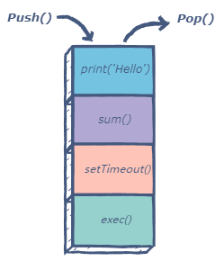
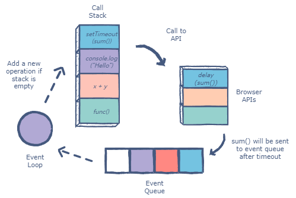

# Event Loop

<aside>
💡 The event loop is the secret behind JavaScript’s asynchronous programming. JS executes all operations on a single thread.

</aside>

# call stack

> Responsible for **keeping track** of all the operations in line to be executed. Whenever a function is finished, it is popped from the stack.
> 

# event queue

> Responsible for **sending new functions to the stack** for processing. It follows the queue data structure to maintain the correct sequence in which all operations should be sent for execution.
> 

# browser API

Whenever an async function is called, it is sent to a **browser API**. These are APIs built into the browser. Based on the command received from the call stack, the **API starts its own single-threaded** operation. The **language** itself is **single-threaded**, but the **browser APIs** act as **separate threads**.

# whole process

The event loop facilitates this process; it constantly **checks** whether or not the call stack is empty. If it is **empty**, new functions are **added** from the event queue. If it is **not**, then the current function call is **processed**.

- Example
    
    An example of this is the `setTimeout` method. When a `setTimeout` operation is processed in the stack, it is sent to the corresponding API which waits till the specified time to send this operation back to event queue. 
    

