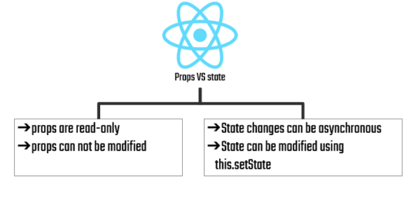

# Component

# Props and state

## Props

They are **read-only** components which must be kept pure **immutable**. They are always passed down from the parent to the child components throughout the application. A child component can never send a prop back to the parent component.

## state

States are the source of data and must be kept as simple as possible. Basically, states are the objects which determine components rendering and behavior. They are **mutable** unlike the props and create dynamic and interactive components. They are accessed via **this.state.**



# stateful Vs stateless

In React, a *stateful* component is a component that holds some state. *Stateless* components, by contrast, have no state. 

The `Store` component is stateful and the `Week` component is stateless.

```jsx
class Store extends React.Component {
  constructor(props) {
    super(props);
    this.state = { sell: 'anything' };
  }
  render() {
    return <h1>I'm selling {this.state.sell}.</h1>;
  }
}

class Week extends React.Component {
  render() {
    return <h1>Today is {this.props.day}!</h1>;
  }
}
```

# Controlled Vs Uncontrolled

Form fields are considered either *uncontrolled*, meaning they **maintain their own state**, or *controlled*, meaning that some **parent maintains their state** and passes it to them to display. Usually, the form fields will be controlled.

```jsx
// Uncontrolled
const uncontrolledInput = <input />;

// Controlled
const controlledInput = (
  <input value={this.state.value} onChange={this.handleInputChange} />
);
```

| Controlled | Uncontrolled |
| --- | --- |
| 1. They do not maintain their own state | 1. They maintain their own state |
| 2. Data is controlled by the parent component | 2. Data is controlled by the DOM |
| 3. They take in the current values through props and then notify the changes via callbacks | 3. Refs are used to get their current values |

# Functional Vs Class

A functional component is a plain JavaScript function that takes in props and returns a React element. A class component is a JavaScript class that extends React.Component and has a render method that returns a React element.

One key difference between the two is that a **class** component can have **local state and lifecycle methods**, while a functional component cannot. However, starting with React 16.8, **functional** components can also have a **state using hooks**.

# presentational Vs container

Container components contain **business logic** (methods) and **handle state**. 

Presentational components **render** that behavior and state to the user.

```jsx
class CounterContainer extends React.Component {
  constructor(props) {
    super(props);
    this.state = { count: 0 };
    this.increment = this.increment.bind(this);
  }

  increment() {
    this.setState((oldState) => {
      return { count: oldState.count + 1 };
    });
  }

  render() {
    return <Counter count={this.state.count} increment={this.increment} />;
  }
}

class Counter extends React.Component {
  render() {
    return (
      <div>
        <p>The count is {this.props.count}.</p>
        <button onClick={this.props.increment}>Add 1</button>
      </div>
    );
  }
}
```