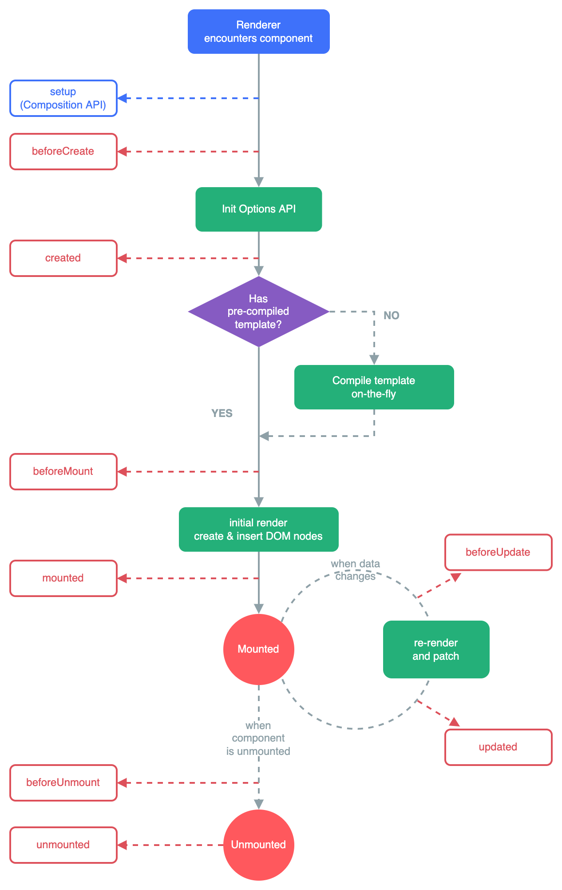

# Lifecycle

1. beforeCreate: hook observes data and **initialization** events in your component. Here, data is still not reactive and events that occur during the component’s lifecycle have not been set up yet.
2. created: invoked when Vue has **set up events and data observation**. Here, events are active and access to reactive data is enabled though templates have not yet been mounted or rendered.
3. beforeMount: access your **component** immediately before and after the first render.
4. mounted: have **full access** to the reactive component, templates, and rendered DOM (via. this.$el). The most frequently used patterns are **fetching data** for your component.
5. beforeUpdate: after **data changes** on your component and the update cycle begins, right **before the DOM** is patched and re-rendered.
6. updated: **after** data changes on your component and the DOM re-renders.
7. beforeDestroy: fired right **before teardown**. If you need to **cleanup events** or reactive subscriptions, beforeDestroy would probably be the time to do it. Your component will still be **fully present and functional**.
8. destroyed: called after your component has been destroyed, its directives have been **unbound** and its event listeners have been **removed**.