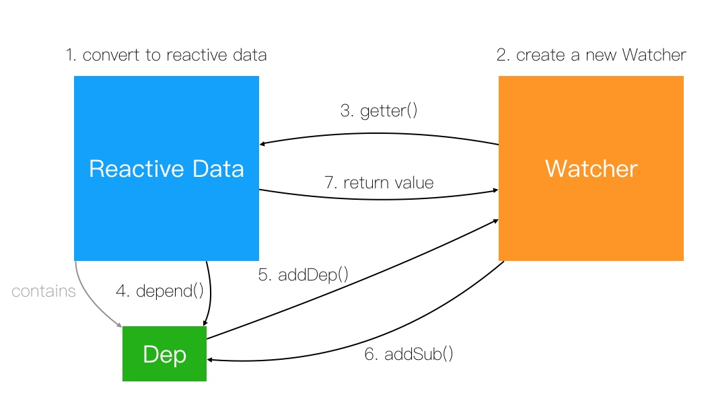

# Two-way Binding



- `Observer` defines the data to be **reactive**. Every `Observer` has a `Dep` to manage `Watcher`s. When Instantiating a `Watcher`, execute `dep.depend()` and trigger adding current `Watcher` to `Dep`’s subscribers list.
- When data changes and triggers `setter`, execute `dep.notify()` and `Dep` will execute all `Watcher`s’ `update` method.

# Observer

> **Recursively** add data object and child object. **Monitor** data read and write.
> 

```jsx
// src/core/observer/index.js
// ...
const dep = new Dep()
// ...
Object.defineProperty(obj, key, {
    enumerable: true,
    configurable: true,
    get: function reactiveGetter () {
        // ...
        dep.depend()
        //...
    },
    set: function reactiveSetter (newVal) {
        // ...
        dep.notify()
    },
```

# Dep

> **Manage watchers.** Each `Dep` instance has an array to store its watchers and tell them to `update()` during `notify()`.
> 

```jsx
addSub (sub: Watcher) {
  this.subs.push(sub)
}

removeSub (sub: Watcher) {
  remove(this.subs, sub)
}

depend () {
  if (Dep.target) {
    Dep.target.addDep(this)
  }
}

notify () {
  // stabilize the subscriber list first
  const subs = this.subs.slice()
  for (let i = 0, l = subs.length; i < l; i++) {
    subs[i].update()
  }
}
```

`Dep.target` is globally unique. It's the watcher being evaluated now. `Dep.target`
 must be a watcher, so `Dep.target.addDep(this)` inside `depend()` tells us watcher has a method named `addDep()`. Its name implies that each watcher also has a list of `Dep`s it's watching.

# Watcher

> If you change a reactive property, it will **trigger watchers' updating**.
> 

```jsx
/**
 * Evaluate the getter, and re-collect dependencies.
 */
get () {
  pushTarget(this)
  let value
  const vm = this.vm
  if (this.user) {
    try {
      value = this.getter.call(vm, vm)
    } catch (e) {
      handleError(e, vm, `getter for watcher "${this.expression}"`)
    }
  } else {
    value = this.getter.call(vm, vm)
  }
  // "touch" every property so they are all tracked as
  // dependencies for deep watching
  if (this.deep) {
    traverse(value)
  }
  popTarget()
  this.cleanupDeps()
  return value
}
```

Call `pushTarget(this)` which changes `Dep.target` to this watcher.

# Example

```jsx
{
  data: {
    name: 'foo'
  },
  computed: {
    newName () {
      return this.name + 'new!'
    }
  }
}
```

We know that `data` will be converted to reactive property, it's value, the object will be observed. If you get data use `this.foo` it will be proxied to `this._data['foo']`.

Now let's try to build a watcher step-by-step:

- assign our input function to getter
- call `this.get()`
- call `pushTarget(this)` which **changes** `Dep.target` to this watcher
- call `this.getter.call(vm, vm)`
- run `return this.foo + 'new!'`
- because `this.foo` is proxied to `this._data[foo]`, the reactive property `_data`'s getter is triggered
- inside the getter, it **calls** `dep.depend()`
- inside `depend()`, it **calls** `Dep.target.addDep(this)`, here `this` refers to the const `dep`, it's `_data`'s dep
- then it calls `childOb.dep.depend()` which add the dep of `childOb` to our target. Notice this time the `this` of `Dep.target.addDep(this)` refers to `childOb.__ob__.dep`
- inside `addDep()`, the **watcher add this dep** to it's `this.newDepIds` and `this.newDeps`
- because the default value of `this.depIds` is `[]`, the watcher **calls** `dep.addSub(this)`
- inside `addSub`, the **dep add the watcher** to it's `this.subs`
- now the watcher has gotten the value, it will `traverse()` the value to collect dependencies, calls `popTarget()` and `this.cleanupDeps()`