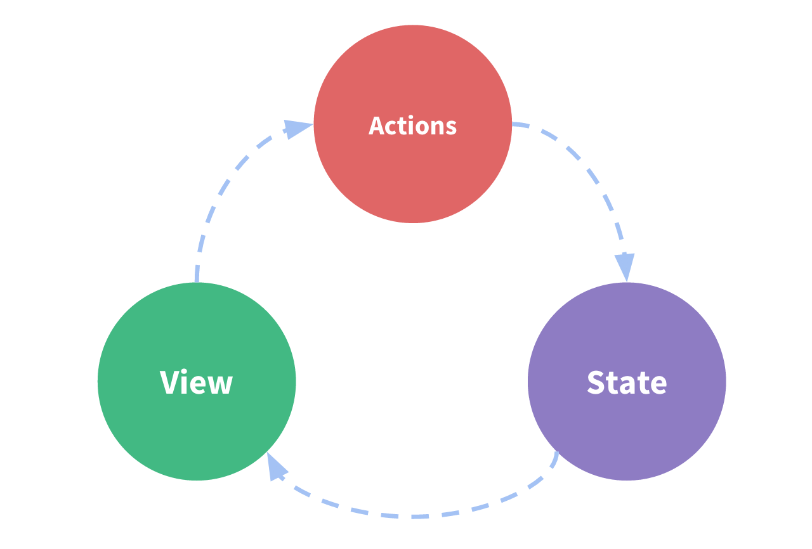

# Vuex

Vuex is a **state management pattern + library** (Flux-inspired Application Architecture) for Vue.js applications. It serves as a centralized store for all the components in an application, with rules ensuring that the state can only be mutated in a predictable fashion.

# state management pattern

1. The **state**, which is the source of truth that drives our app
2. The **view**, which is just a declarative mapping of the state
3. The **actions**, which are the possible ways the state could change in reaction to user inputs from the view.

```jsx
new Vue({
   // state
   data () {
     return {
       count: 0
     }
   },
   // view
   template: `
     <div>{{ count }}</div>
   `,
   // actions
   methods: {
     increment () {
       this.count++
     }
   }
 })
```

# one way data flow



# vuex store

A Vuex "store" is basically a container that **holds** your application **state**.

1. Configure vuex in vuejs **ecosystem**.

```jsx
import Vuex from "vuex";
Vue.use(Vuex)
```

1. Provide an **initial state** object and some mutations.

```jsx
// Make sure to call Vue.use(Vuex) first if using a module system

const store = new Vuex.Store({
  state: {
    count: 0
  },
  mutations: {
    increment (state) {
      state.count++
    }
  }
})
```

> Vuex **mutations** are similar to any events with a string `type` and a `handler`. The handler function is where we **perform** actual state modifications, and it will receive the state as the first argument.
> 
1. Trigger **state change** with commit and access state variables.

```jsx
store.commit('increment')

console.log(store.state.count) // -> 1
```